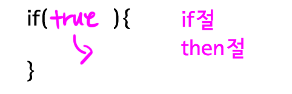
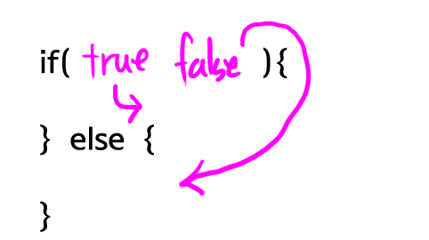
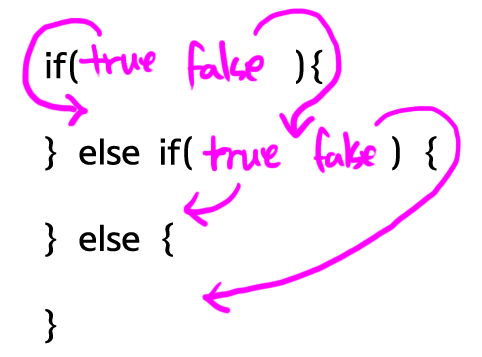

# **조건문**
조건문이란 **주어진 조건**에 따라서 애플리케이션을 다르게 동작하도록 하는 것으로 프로그래밍의 핵심 중의 하나라고 할 수 있습니다.  
<br><br>
## **1. if**
 <br>
위 사진은 if 문의 문법 구조를 나타낸 것입니다. if 문 뒤의 괄호를 **" if 절 "** 이라고 부르고 이 if 절의 내용이 **참(True)** 일 경우 중괄호 안의 절이 실행되고 거짓이라면 실행되지 않습니다. 아래는 if 문을 사용한 코드입니다.
<br><br>
```
public class Condition1Demo {
 
    public static void main(String[] args) {
        if(true){
            System.out.println("result : true");
        }
    }
}
```
해당 코드의 실행결과는 **" result : true "** 입니다. if 절 안에 참(True)이 왔기 때문입니다.
<br><br>
```
if(false){
    System.out.println("result : true");
}
```
반대로 if 절 안의 괄호가 거짓(False) 일 때는 중괄호 안이 실행되지 않아 아무것도 출력되지 않습니다.  
<br><br>
```
public class Condition2Demo {
 
    public static void main(String[] args) {
        if (true) {
            System.out.println(1);
            System.out.println(2);
            System.out.println(3);
            System.out.println(4);
        }
        System.out.println(5);
    }
 
}
```
해당 코드의 실행 결과는 12345입니다. if 문 안의 코드를 실행한 후 중괄호를 빠져나와 5를 출력했기 때문입니다.  
<br><br>
```
if(false){
    System.out.println(1);
    System.out.println(2);
    System.out.println(3);
    System.out.println(4);
}
System.out.println(5);
```
반대로 해당 코드는 5만 출력할 것 입니다. if 절이 거짓이므로 중괄호를 실행시키지 못하고 빠져나와 5만을 출력했기 때문입니다.

<br><br>
## **1-1. else**
 <br>
else문은 if 문 만으로는 해결되지 않는 더 복잡한 상황을 처리하는데 사용되는 절입니다.

<br><br>
```
public class Condition3Demo {
 
    public static void main(String[] args) {
        if (true) {
            System.out.println(1);
        } else {
            System.out.println(2);
        }
 
    }
 
}
```
해당 코드의 결과는 1 입니다. if 절이 참이기 때문에 else 절은 출력하지 않기 때문입니다.

<br><br>
```
if(false){
    System.out.println(1);
} else {
    System.out.println(2);
}
```
해당 코드의 결과는 2 입니다. if 절이 거짓이므로 else 문만이 출력되기 때문입니다.

<br><br>
## **1-2. if-else**
 <br>
if-else 절은 else 절 보다도 조건문을 더 자유롭게 제어할 수 있게 도와주는 조건문입니다.  
<br><br>
```
public class ElseDemo {
 
    public static void main(String[] args) {
        if (false) {
            System.out.println(1);
        } else if (true) {
            System.out.println(2);
        } else if (true) {
            System.out.println(3);
        } else {
            System.out.println(4);
        }
 
    }
 
}
```
다음 코드의 결과는 2입니다. if 문에서 거짓이므로 else-if 문으로 넘어간 후 2번에 else-if에서 참을 찾아 2라는 값을 출력했기 때문입니다. 참(True)의 값이 여러개더라도 처음 참의 실행문만 실행합니다. 

<br><br>
## **1-3. 중첩 if**
하나의 코드에서 2번, 또는 여러번의 검사를 실행해야 한다면 어떻게 해야할까요? 이럴 때 사용하는 것이 바로 중첩 if 문 입니다. 아래 코드를 보겠습니다.

<br>

```
public class ifinif {
    public static void main(String[] args) {
        String id = "id"
        String password = "password"
        if (id = "id") {
            if (password = "password") {
                System.out.println("right");
            } else {
                System.out.println("wrong");
            }
 
        } else {
            System.out.println("wrong");
        }
    }
}
``` 
해당 코드에서는 문자열 변수인 id , password 가 모두 옳은 값이여야만 **" right "** 를 출력하고 나머지는 모두 " wrong " 을 출력하게 됩니다. 이렇게 **if 문 안에 if문을 넣어 조건을 여러번 검수 하는 방법** 을 중첩 if 라고 합니다.