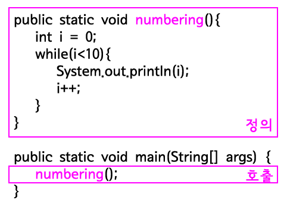

# **메소드**
메소드는 재사용할 수 있는 코드의 집합을 의미합니다.

클래스에서 메소드를 작성하여 사용하는 이유는 중복되는 코드의 반복적인 프로그래밍을 피할 수 있기 때문입니다.

또한, 모듈화로 인해 코드의 가독성도 좋아집니다.

그리고 프로그램에 문제가 발생하거나 기능의 변경이 필요할 때도 손쉽게 유지보수를 할 수 있게 됩니다.

<br><br>

## **메소드의 형식과 선언**
<br><br>
메소드는 사실 자바를 처음 시작했을 때부터 사용되고 있었습니다.


<br><br>
이것이 메소드의 기본 형식입니다. 나머지는 아래 코드를 보겠습니다.

```java
public class MethodDemo1 {
    public static void numbering() {
        int i = 0;
        while (i < 10) {
            System.out.println(i);
            i++;
        }
    }
 
    public static void main(String[] args) {
        numbering();
    }
}
```
<br><br>
결과는 아래와 같습니다.
```
0
1
2
3
4
5
6
7
8
9
```

<br><br>
아래 그림을 봅시다.


<br><br>
위의 코드는 numbering이라는 이름의 메소드를 정의하고 있습니다. 이 메소드는 main이라는 이름의 메소드 안에서 호출되고 있습니다. 위의 코드는 아래의 코드와 정확하게 동일한 의미를 갖습니다.

<br><br>


<br><br>
핑크색으로 표시한 부분의 코드를 numbering이라는 이름의 메소드로 묶어서 외부로 분리한 것입니다. 그리고 메소드 numbering의 로직이 필요할 때 numbering();이라고하면 메소드 numbering의 로직이 실행됩니다.

<br><br>

## **메소드가 없다면**
<br><br>
이렇게 메소드에 대한 설명을 들었어도 아직은 메소드에 대한 필요성을 느끼지 못했을 수 도 있습니다. 그렇다면 아래 코드를 보겠습니다.

```java
public class MethodDemo2 {
     
    public static void main(String[] args) {
        int i = 0;
        while(i<10){
            System.out.println(i);
            i++;
        }
         
        i = 0;
        while(i<10){
            System.out.println(i);
            i++;
        }
         
        i = 0;
        while(i<10){
            System.out.println(i);
            i++;
        }
         
        i = 0;
        while(i<10){
            System.out.println(i);
            i++;
        }
         
        i = 0;
        while(i<10){
            System.out.println(i);
            i++;
        }
    }
 
}
```
<br>
이 정도는 복사 붙여넣기를 사용하면 가급적 쉽게 만들 수 있습니다. 하지만 만약 이것을 1000번 해야 한다면? 각각의 로직이 1000 줄에 육박한다면? 그리고 그 내용을 수정해야 한다면? 메소드를 사용한다면 이러한 문제를 현저히 줄일 수 있습니다. 이러한 것을 재활용성이라고 하며 아래 코드에서 자세한 내용을 보겠습니다.

<br><br>


```java
public class MethodDemo3 {
    public static void numbering() {
        int i = 0;
        while (i < 10) {
            System.out.println(i);
            i++;
        }
    }
 
    public static void main(String[] args) {
        numbering();
        numbering();
        numbering();
        numbering();
        numbering();
    }
}
```

<br><br>

## **입력과 출력**

